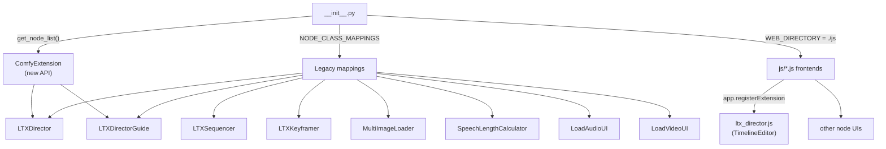
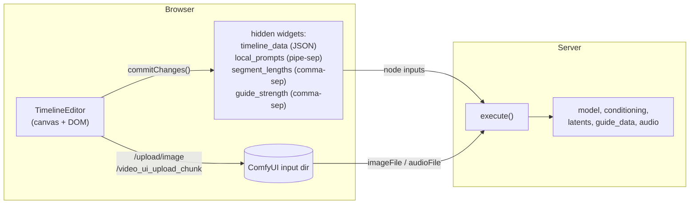

# Architecture

How the package is registered, how the two node API styles differ, and how the
JavaScript frontends talk to the Python backends.

## Registration

`__init__.py` registers nodes two ways so the package works across ComfyUI
versions:

- **New API** — `PromptRelay(ComfyExtension)` exposes `get_node_list()` returning
  the `io.ComfyNode` subclasses (`LTXDirector`, `LTXDirectorGuide`), and
  `comfy_entrypoint()` returns the extension instance.
- **Legacy API** — `NODE_CLASS_MAPPINGS` / `NODE_DISPLAY_NAME_MAPPINGS` register
  every node (including the legacy-style ones).
- **Frontend** — `WEB_DIRECTORY = "./js"` tells ComfyUI to serve the JS extensions.



## The two node API styles

### New style — `io.ComfyNode`

Used by LTX Director, Director Guide, Sequencer, Keyframer. Imported from
`comfy_api.latest.io`.

```python
class LTXDirector(io.ComfyNode):
    @classmethod
    def define_schema(cls):
        return io.Schema(
            node_id="LTXDirector", display_name="LTX Director",
            category="WhatDreamsCost",
            inputs=[ io.Model.Input("model"), io.Clip.Input("clip"), ... ],
            outputs=[ io.Model.Output(...), io.Conditioning.Output(...), ... ],
        )

    @classmethod
    def execute(cls, model, clip, ...) -> io.NodeOutput:
        return io.NodeOutput(patched, conditioning, ...)
```

- Inputs/outputs are typed objects (`io.Model`, `io.Clip`, `io.Latent`,
  `io.Image`, `io.String`, `io.Int`, `io.Float`, `io.Combo`, `io.Boolean`,
  `io.Audio`, `io.Vae`, `io.Conditioning`).
- **Custom socket types** use `io.Custom("NAME")`. `GuideData = io.Custom("GUIDE_DATA")`
  in `ltx_director.py` is the private channel between LTX Director and LTX Director
  Guide.
- `execute` is a classmethod returning `io.NodeOutput(*outputs_in_order)`.

### Legacy style — dict-based

Used by Multi Image Loader, Speech Length Calculator, Load Audio/Video UI.

```python
class MultiImageLoader:
    @classmethod
    def INPUT_TYPES(s):
        return {"required": {"image_paths": ("STRING", {"multiline": True}), ...}}
    RETURN_TYPES = ("IMAGE",) * 51
    RETURN_NAMES = ("multi_output",) + tuple(f"image_{i+1}" for i in range(50))
    FUNCTION = "load_images"
    CATEGORY = "WhatDreamsCost"
```

Note `VALIDATE_INPUTS` returning `True` in `LoadAudioUI` to bypass the "Value not
in list" dropdown error and let the fallback-silence logic run.

## Frontend ↔ backend wiring

ComfyUI image/tensor data never crosses the JS↔Python boundary directly. Instead,
the frontend serializes editor state into **hidden string widgets**, and the Python
`execute()` reads those widget values as ordinary node inputs. Media files are
uploaded to the ComfyUI **input directory** and referenced by filename.



Key points:

- The JS finds widgets by name: `node.widgets.find(w => w.name === "timeline_data")`.
- New widgets that don't exist in the Python schema are appended in
  `onNodeCreated` (`APPENDED_WIDGET_DEFAULTS` in `ltx_director.js`).
- Hidden widgets are visually suppressed via `hideWidget()` (sets
  `computeSize = () => [0, -4]`, `type = "hidden"`).
- Persistence: widget values are saved in the workflow JSON by ComfyUI; on load,
  `onConfigure` re-parses `timeline_data` and rebuilds the editor.

## File map

```
WhatDreamsCost-ComfyUI/
├── __init__.py                  # registration (new + legacy)
├── prompt_relay.py              # temporal mask algorithm (shared)
├── patches.py                   # cross-attn forward patching (Wan / LTX)
├── ltx_director.py              # LTX Director backend
├── ltx_director_guide.py        # LTX Director Guide backend (subclasses LTXVAddGuide)
├── ltx_sequencer.py             # subclasses LTXVAddGuide
├── ltx_keyframer.py             # io.ComfyNode
├── multi_image_loader.py        # legacy
├── speech_length_calculator.py  # legacy
├── load_audio_ui.py             # legacy
├── load_video_ui.py             # legacy + 2 aiohttp routes
├── js/                          # served as WEB_DIRECTORY
│   ├── ltx_director.js          # TimelineEditor (the big one, ~3.9k lines)
│   ├── ltx_director_guide.js
│   ├── ltx_sequencer.js
│   ├── ltx_keyframer.js
│   ├── multi_image_loader.js
│   ├── speech_length_calculator.js
│   ├── load_audio_ui.js
│   └── load_video_ui.js
├── example_workflows/           # .json + .png reference workflows
└── docs/                        # this folder
```

## HTTP routes (server-side)

`load_video_ui.py` registers two aiohttp routes on `PromptServer.instance`:

- `GET /video_ui_custom_view?filename=...` — serves a media file for preview.
  Hardened: `os.realpath` + extension allow-list (`_ALLOWED_PREVIEW_EXTS`) so it
  can't be used as an arbitrary-file-read primitive.
- `POST /video_ui_upload_chunk` — chunked upload to bypass the 413 limit. Hardened:
  `os.path.basename` strips directory components and a `commonpath` check confirms
  the resolved path stays inside the input dir.

`ltx_director_bundle.py` registers two more for the LTX Director timeline **bundle**
(portable zip) feature (see [ltx-director.md](ltx-director.md#saveload--bundles)):

- `POST /ltx_director/save_bundle` — zips `timeline.json` + the referenced media into
  a downloadable archive. Hardened: each media path is resolved with `realpath` and a
  `commonpath` check rejects anything outside the input dir.
- `POST /ltx_director/load_bundle` — extracts an uploaded zip's `media/*` into
  `input/<bundleName>/`. Hardened: sanitised bundle name, a media-extension
  allow-list, and a **per-entry zip-slip containment assertion** before each write.

These hardening patterns are the reference for any new route in this package — see
the security notes in [the skill](../.claude/skills/whatdreamscost-comfyui/SKILL.md).
