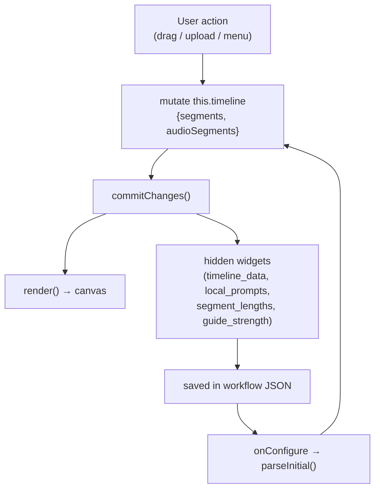
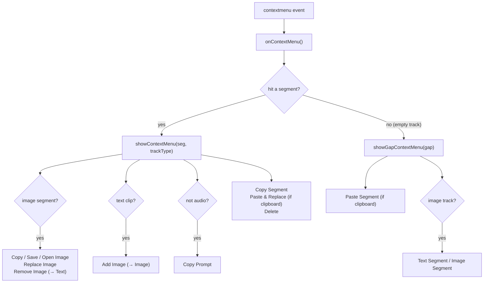
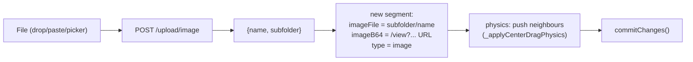
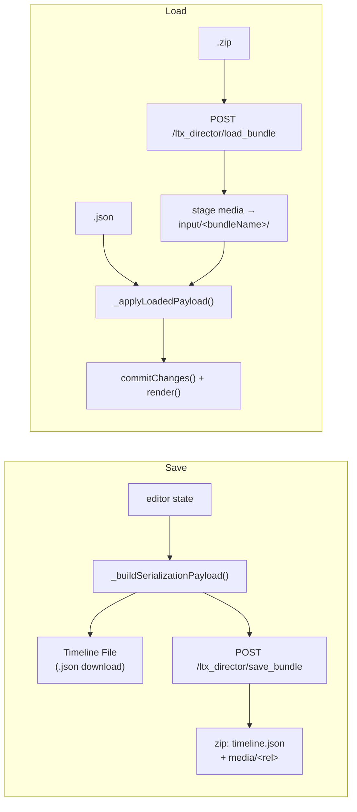
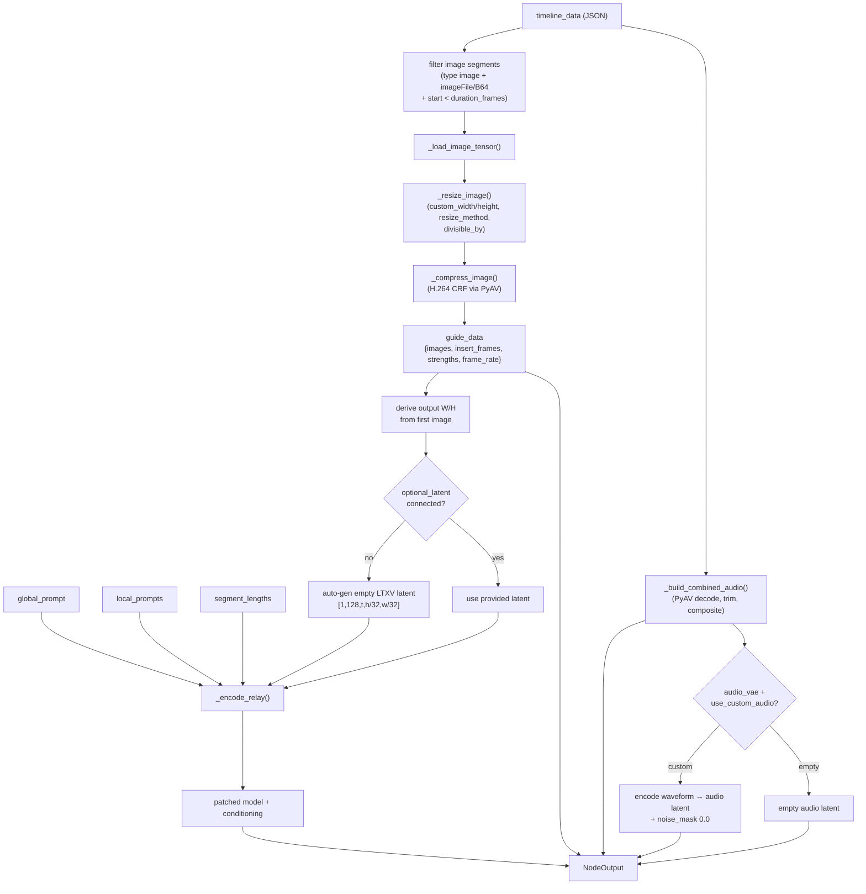
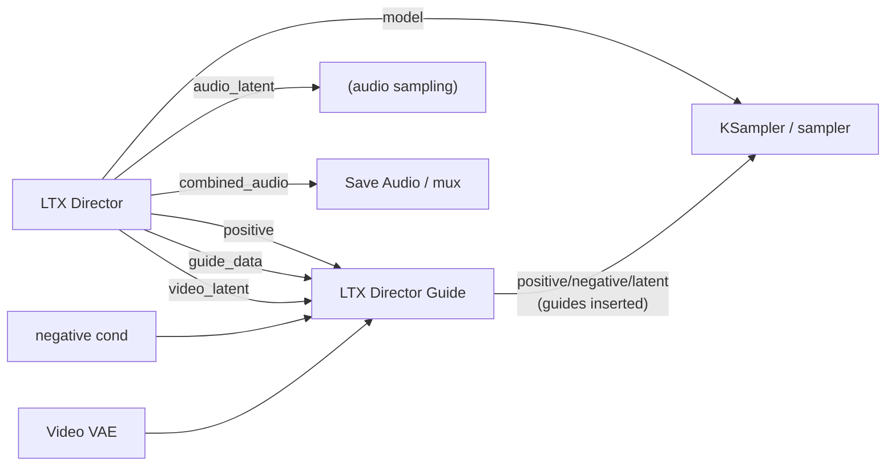

# LTX Director

The flagship node: a video-editor-style timeline rendered inside the ComfyUI node
that drives LTX video + audio generation. Frontend is
[`js/ltx_director.js`](../js/ltx_director.js) (the `TimelineEditor` class). Backend
is [`ltx_director.py`](../ltx_director.py).

This is the most important doc for feature work on the node. Read
[prompt-relay.md](prompt-relay.md) alongside it for the masking internals.

## Contents

- [Mental model](#mental-model)
- [The timeline data model](#the-timeline-data-model)
- [The widget data bus](#the-widget-data-bus)
- [`commitChanges()` — serialization](#commitchanges--serialization)
- [Context menus](#context-menus)
- [Image upload path](#image-upload-path)
- [Save/load & bundles](#saveload--bundles)
- [Backend `execute()` pipeline](#backend-execute-pipeline)
- [End-to-end dataflow](#end-to-end-dataflow)
- [Lifecycle hooks](#lifecycle-hooks)
- [Pixel space vs latent space](#pixel-space-vs-latent-space)
- [Gotchas](#gotchas)

## Mental model

The editor owns an in-memory `this.timeline = { segments, audioSegments }`. Every
mutation (drag, upload, menu action) updates that object and then calls
`commitChanges()`, which **derives** four flat widget strings the Python side
consumes. The canvas is a pure render of `this.timeline`; the widgets are the
serialized projection of it.



## The timeline data model

`this.timeline` has two arrays. IDs are assigned on creation and on load
(`parseInitial`) so drag tracking survives a reload.

### Image/text segments — `timeline.segments[]`

| Field | Type | Notes |
|-------|------|-------|
| `id` | string | `Date.now()+random`; guaranteed by `parseInitial` |
| `start` | number | **pixel-space** frame where the segment begins |
| `length` | number | pixel-space frame count |
| `type` | string | `"image"` or `"text"` (transient: `"ghost"`, `"temp"`) |
| `prompt` | string | the segment's local prompt (used for both image and text segments) |
| `imageFile` | string | input-dir-relative path, e.g. `sub/foo.png` — **the real image source** |
| `imageB64` | string | usually a `/view?...` URL (not real base64); used for thumbnails/preview |
| `imgObj` | Image | runtime-only ``; **stripped before serialization** |
| `guideStrength` | number | per-image guide strength, default `1.0` |

> **Image vs text is just `type` + presence of `imageFile`/`imageB64`.** A text
> segment is a segment with `type: "text"` and no image fields. This is the seam the
> right-click "convert image↔text clip" items use: `_attachImageToSegment`
> (text→image, also powers "replace image") and `_convertSegmentToText` (image→text)
> flip `type` and add/remove the image fields, then `commitChanges()`.

### Audio segments — `timeline.audioSegments[]`

| Field | Type | Notes |
|-------|------|-------|
| `id` | string | as above |
| `start` | number | pixel-space frame on the timeline |
| `length` | number | pixel-space frame count (post-trim) |
| `trimStart` | number | frames trimmed off the **source** file's head (default 0) |
| `audioFile` | string | input-dir-relative path — the real audio source |
| `audioB64` | string | fallback base64 (used if `audioFile` absent) |

### Persisted JSON shape (`timeline_data` widget)

```json
{
  "segments": [
    { "id": "...", "start": 0, "length": 24, "type": "image",
      "prompt": "a fox", "imageFile": "fox.png", "imageB64": "/view?...",
      "guideStrength": 1.0 },
    { "id": "...", "start": 24, "length": 48, "type": "text", "prompt": "it runs" }
  ],
  "audioSegments": [
    { "id": "...", "start": 0, "length": 120, "trimStart": 0, "audioFile": "vo.mp3" }
  ],
  "globalPromptVisible": true
}
```

> **`globalPromptVisible`** records the "Use Global Prompt" enabled state. ComfyUI
> does not serialize a widget's visibility natively, so this flag is how it survives a
> reload — see [Save/load & bundles](#saveload--bundles) and
> [Lifecycle hooks](#lifecycle-hooks).
>
> **Portability caveat:** the plain JSON references media by `imageFile`/`audioFile`
> into the ComfyUI input dir, so it is **not self-contained** — moving the JSON alone
> breaks the media links. The **Bundle** export ([below](#saveload--bundles)) packages
> the media too and stages it back into `input/<bundleName>/` on load to solve this.

## The widget data bus

`execute()` receives ordinary node inputs; the editor packs its state into these
hidden string widgets (constants `HIDDEN_WIDGET_NAMES`):

| Widget | Format | Produced from |
|--------|--------|---------------|
| `timeline_data` | JSON (full state + `globalPromptVisible`) | `this.timeline` minus `imgObj` |
| `local_prompts` | `" | "`-joined | one entry per contiguous segment slot |
| `segment_lengths` | `","`-joined | pixel lengths, gaps absorbed, clipped to duration |
| `guide_strength` | `","`-joined | per **non-text** segment strength (`.toFixed(2)`) |
| `use_custom_audio` | boolean widget | toolbar toggle |

`global_prompt` is a normal (optionally hidden) widget, toggled via the settings
menu "Use Global Prompt" checkbox (`_setGlobalPromptVisible()`). Its enabled state is
not natively serialized by ComfyUI, so `commitChanges()` persists it as
`globalPromptVisible` inside `timeline_data` and `_restoreGlobalPromptVisibility()`
re-applies it on load.

## `commitChanges()` — serialization

`commitChanges(skipRender=false)` (around `ltx_director.js:2761`) is the single
serialization choke point. It:

1. Sorts `segments` by `start`.
2. Walks them building **contiguous** lengths + prompts: gaps before/between
   segments are absorbed into the previous segment's length; everything is clipped
   at `durationFrames` (the output duration), and the last segment is padded to fill
   to `durationFrames`. (This is why on-screen positions and the emitted
   `segment_lengths` differ — the timeline is visual, the relay needs a gapless
   partition.)
3. Writes `timeline_data` = `JSON.stringify({ segments (minus imgObj), audioSegments, globalPromptVisible })`.
4. Writes `local_prompts` = prompts joined by `" | "`.
5. Writes `segment_lengths` = contiguous lengths joined by `","`.
6. Writes `guide_strength` = strengths of non-text segments joined by `","`.
7. Resizes the node and re-renders.

> Any new feature that changes segments must end by calling `commitChanges()` or the
> Python side won't see it. Use `commitChanges(true)` to skip the immediate re-render
> when you'll render separately.

## Context menus

Right-click is handled by `onContextMenu(e)` (`ltx_director.js:2899`). It
hit-tests the cursor against tracks/segments and dispatches to one of two builders:



- **`showContextMenu(clientX, clientY, seg, trackType)`** — per-segment menu. Builds
  `<button class="pr-gap-menu-btn">` elements appended to a `div.pr-gap-menu`. Each
  button sets `.onclick`, mutates `this.timeline`, calls `commitChanges()`, then
  `dismissContextMenu()`. `isImage = trackType !== "audio" && trackType !== "text" && seg.imageB64`.
  Image clips show **Replace Image…** and **Remove Image (→ Text)**; text clips show
  **Add Image (→ Image)…**, calling `_attachImageToSegment` / `_convertSegmentToText`
  via `_pickImageForSegment` (see [the data model note](#the-timeline-data-model)).
- **`showGapContextMenu(clientX, clientY, gap)`** — empty-track menu. Offers
  "Text Segment" (`addSegmentInGap(...,"text")`) and "Image Segment" (file picker →
  `handleImageUpload(files, gap.frameStart, gapLength)`), plus paste.
- **Clipboard state**: `this._copiedSegment` / `this._copiedSegmentTrack` back the
  Copy/Paste items (in-editor, not the OS clipboard).
- Menus are dismissed by a `pointerdown` listener installed on `document` (capture).

The styling classes `pr-gap-menu` / `pr-gap-menu-btn` are defined in the `STYLES`
template literal near the top of the file. **Reuse these classes** for any new menu
items so they match.

## Image upload path

`handleImageUpload(files, targetFrameStart=null, explicitLength=null)`
(`ltx_director.js:1412`) is the canonical way an image becomes a segment:



- Upload is `api.fetchApi("/upload/image", {method:"POST", body: FormData})`.
- `imageFile` = `subfolder ? subfolder + "/" + filename : filename`.
- `imageB64` is set to the `/view?...` URL, and an `Image` is loaded into `imgObj`
  for canvas drawing.
- Other entry points: toolbar Upload button, drag-and-drop (`drop` listener),
  paste (`handlePaste`), and the gap menu "Image Segment".

> **Replacing/attaching** an image on an existing segment is implemented by
> `_attachImageToSegment(file, seg)`: the same `/upload/image`, then assign
> `seg.imageFile`/`seg.imageB64`/`seg.imgObj` onto the existing segment (and set
> `type="image"`) instead of pushing a new one, then `commitChanges()`.

## Save/load & bundles

The settings (gear) menu has two **Save/Load** rows that serialize the whole timeline
(plus every node setting) to a file and restore it. All frontend except the bundle
archive, which is backed by hardened routes in
[`ltx_director_bundle.py`](../ltx_director_bundle.py).

**Payload shape** (`_buildSerializationPayload()`):

```json
{
  "format": "ltx-director-timeline",
  "version": 1,
  "timeline": { "segments": [], "audioSegments": [], "globalPromptVisible": true },
  "settings": {
    "global_prompt": "...", "global_prompt_visible": true,
    "duration_frames": 120, "duration_seconds": 5, "frame_rate": 24,
    "display_mode": "seconds", "epsilon": 0.001, "divisible_by": 32,
    "img_compression": 18, "custom_width": 0, "custom_height": 0,
    "resize_method": "maintain aspect ratio", "use_custom_audio": false
  }
}
```

`timeline` is the parsed `timeline_data` widget; the derived widgets
(`local_prompts`/`segment_lengths`/`guide_strength`) are **not** stored —
`_applyLoadedPayload()` rebuilds them by calling `commitChanges()` after restoring.
`_applyLoadedPayload()` is the single apply path for both flavours and mirrors the
`onConfigure` restore (set widgets → restore global-prompt value + visibility →
`parseInitial` → `loadImages` → `commitChanges` → `render`).

| Flavour | Save / Load | Media | Self-contained? |
|---------|-------------|-------|-----------------|
| **Timeline File** | `saveTimelineToFile` / `loadTimelineFromFile` | referenced by `imageFile`/`audioFile` | No |
| **Bundle (zip)** | `saveBundleToFile` / `loadBundleFromFile` | packaged in the zip | Yes |



**Bundle routes** (`ltx_director_bundle.py`):

- `POST /ltx_director/save_bundle` — reads each media reference from the input dir
  (rejecting anything that escapes it via `realpath` + `commonpath`), zips
  `timeline.json` + `media/<rel>`, returns the archive.
- `POST /ltx_director/load_bundle` — extracts `media/*` into `input/<bundleName>/`
  (sanitised name; per-entry zip-slip containment assertion; media-extension
  allow-list), re-points each clip's `imageFile`/`audioFile` to `<bundleName>/<rel>`,
  and returns the manifest for `_applyLoadedPayload()`. Existing files are overwritten.

See the [security note](architecture.md#http-routes-server-side) for the hardening
pattern these routes follow.

## Backend `execute()` pipeline

`LTXDirector.execute()` (`ltx_director.py:471`) consumes the widget bus:



Outputs, in order: `model`, `positive` (conditioning), `video_latent`,
`audio_latent`, `guide_data`, `frame_rate`, `combined_audio`.

Helper functions in `ltx_director.py`:

- `_load_image_tensor(seg)` — `imageFile` first (from input dir), else `imageB64`
  (skipped if it starts with `/view?`), else a 512×512 black fallback. Returns
  `[1,H,W,3]` float32.
- `_resize_image(tensor, w, h, method, divisible_by)` — methods: `stretch to fit`,
  `maintain aspect ratio`, `pad`, `crop`; snaps dims to `divisible_by`.
- `_compress_image(tensor, crf)` — single-frame libx264 encode/decode for artefacts;
  `crf=0` is a no-op.
- `_build_combined_audio(timeline_data, duration_frames, frame_rate)` — parses
  `audioSegments`, decodes each via PyAV → 44.1 kHz stereo float32, trims by
  `trimStart`/`length`, positions at `start`, additively composites onto a
  timeline-length buffer.
- `_convert_to_latent_lengths(...)` / `_encode_relay(...)` — the prompt-relay bridge
  (see [prompt-relay.md](prompt-relay.md)).

If no image segments exist, a strength-0 dummy image is inserted so pure
text-to-video doesn't artefact.

## End-to-end dataflow

How LTX Director and LTX Director Guide combine in a workflow:



`LTXDirectorGuide.execute()` (`ltx_director_guide.py`) subclasses
`comfy_extras.nodes_lt.LTXVAddGuide`. For each entry in `guide_data` it encodes the
image, computes the latent index from the pixel `insert_frame`, and calls
`append_keyframe(...)` to write the guide into the latent + conditioning. It clones
latents/masks to avoid mutating upstream nodes and clamps `scale_by` results to ≥1
to avoid zero-sized latents.

## Lifecycle hooks

Registered in `app.registerExtension({ name: "LTXDirector", beforeRegisterNodeDef })`
at the bottom of `ltx_director.js`:

- **`onNodeCreated`** — appends missing widgets (`APPENDED_WIDGET_DEFAULTS`), hides
  the bus widgets, hides `global_prompt` by default, sets default node width 1000,
  creates the DOM container via `addDOMWidget("timeline_ui", ...)`, then constructs
  `new TimelineEditor(...)` on a `setTimeout(0)`. The constructor restores
  `globalPromptVisible` (via `_restoreGlobalPromptVisibility()`) **before** its first
  `commitChanges()`, so the default-hidden state can't overwrite the saved flag.
- **`onConfigure(info)`** — after a workflow loads, re-parses `timeline_data`,
  restores global-prompt visibility, `loadImages()`, clamps selection, re-renders.
  This is the **restore** path.
- **`onRemoved`** — `this._timelineEditor?.destroy()`.

## Pixel space vs latent space

- The timeline is **pixel-space frames** throughout (segment `start`/`length`,
  `insert_frames`, `duration_frames`). `duration_frames` only sets the visual scale;
  the real frame count comes from the latent.
- LTX temporal compression: `latent_frames = ((pixel_length - 1) // 8) + 1` (the `8`
  is the VAE temporal stride from `patches.detect_model_type`). The auto-generated
  latent is `[1, 128, latent_t, h/32, w/32]`.
- `duration_seconds = duration_frames / frame_rate`; the editor keeps the two
  duration widgets in sync via callbacks. `display_mode` (`frames`/`seconds`) only
  changes the on-screen ruler/labels, never storage.

## Gotchas

- **Always `commitChanges()` after mutating `this.timeline`** or the backend sees
  stale data.
- **Strip `imgObj` before serializing** — `commitChanges` already does via
  destructuring `const { imgObj, ...rest } = s`. Don't `JSON.stringify` a raw
  segment with a live `Image` on it.
- **`guide_strength` is non-text segments only**, in sorted order, so it aligns with
  the image list the backend builds.
- **`imageB64` is misleadingly named** — it normally holds a `/view?` URL. The
  backend explicitly ignores `/view?` values and relies on `imageFile`.
- **Menu dismissal listeners** are added on `document` with capture; if you add a new
  menu, mirror the `dismiss*` cleanup or you'll leak listeners.
- **Force-refresh trick**: several settings toggles double-toggle `display_mode` to
  force ComfyUI to recompute the node — copy that pattern if a widget visibility
  change doesn't visually take effect.
- **Widget visibility isn't serialized by ComfyUI.** The global-prompt enabled state
  survives reloads only because `commitChanges()` writes `globalPromptVisible` into
  `timeline_data` and `_restoreGlobalPromptVisibility()` re-applies it in the editor
  constructor and `onConfigure`. Persisting any other per-widget visibility needs the
  same treatment.
