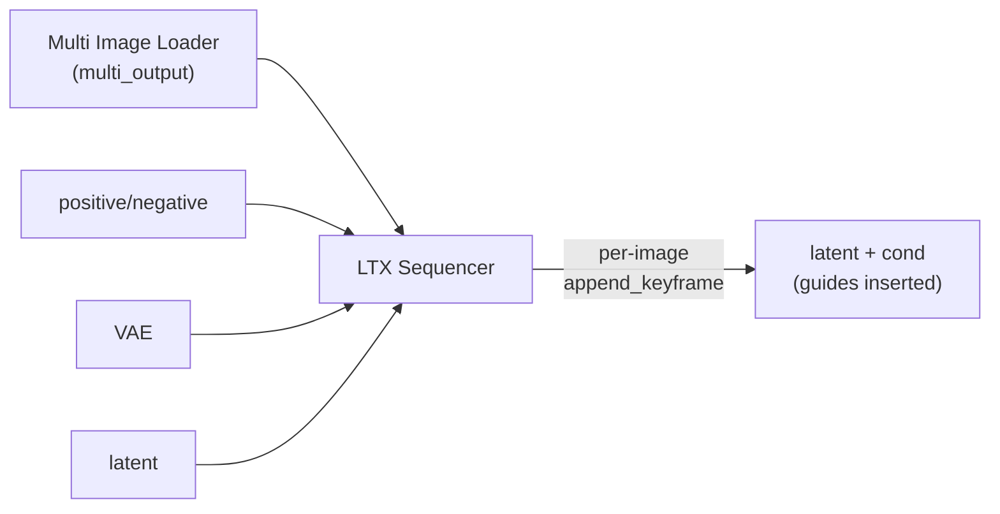

# Other Nodes Reference

Reference for the nodes other than LTX Director (see [ltx-director.md](ltx-director.md)
for that) and LTX Director Guide (covered in
[ltx-director.md](ltx-director.md#end-to-end-dataflow)).

## LTX Sequencer — `ltx_sequencer.py`

Subclasses `comfy_extras.nodes_lt.LTXVAddGuide`. Inserts multiple guide images into a
latent at chosen frame/second positions with per-image strength.

- **Inputs**: `positive`, `negative`, `vae`, `latent`, `multi_input` (batched images,
  typically from Multi Image Loader), `num_images` (how many index/strength rows to
  use), `insert_mode` (`frames`/`seconds`), `frame_rate`, and 50 dynamic triplets
  `insert_frame_{i}` / `insert_second_{i}` / `strength_{i}`.
- **Outputs**: `positive`, `negative`, `latent` (guides added).
- **Logic**: for each `i` up to `num_images` (and within the batch size), resolve the
  frame index (`insert_second_{i} * frame_rate` when in seconds mode), then
  `encode → get_latent_index → append_keyframe` (inherited from `LTXVAddGuide`).
- Clones latent + noise mask to avoid mutating upstream.

## LTX Keyframer — `ltx_keyframer.py`

`io.ComfyNode`. **Replaces** latent frames with encoded images (vs Sequencer's guide
append). README notes Sequencer is generally preferred.

- **Inputs**: `vae`, `latent`, `multi_input`, `num_images`, plus 50 dynamic
  `insert_frame_{i}` / `strength_{i}` pairs.
- **Output**: `latent` (frames replaced, noise mask updated).
- **Logic**: for each image, encode to latent `t`, convert pixel `insert_frame` to a
  latent index (`insert_frame // time_scale_factor`, supports negative indexing),
  overwrite `samples[:, :, latent_idx:end_index]`, and set the noise mask region to
  `1.0 - strength`.

## Multi Image Loader — `multi_image_loader.py`

Legacy-style gallery loader. Resize + JPEG-compression in one node.

- **Inputs**: `image_paths` (newline-separated, multiline), `width`, `height`,
  `interpolation` (lanczos/nearest/bilinear/bicubic/area/nearest-exact),
  `resize_method` (keep proportion/stretch/pad/crop), `multiple_of`,
  `img_compression`.
- **Outputs**: 51 IMAGE sockets — `multi_output` (batched) + `image_1..image_50`
  (individual, zero-padded).
- **Logic**: per path, load (EXIF-transpose, RGB) → `resize_image(...)` →
  optional JPEG re-encode for compression artefacts. Batches into `multi_output`
  only if all results share a shape (resize methods like "keep proportion" can yield
  mismatched sizes, in which case `multi_output` is a zero tensor but individual
  outputs still work).
- The JS (`js/multi_image_loader.js`) provides the gallery/drag-reorder UI and
  right-click copy/open/save.

## Speech Length Calculator — `speech_length_calculator.py`

Legacy-style. Realtime frame-count estimate from dialogue.

- **Inputs**: `text` (multiline; quoted text = speech), `fps`, `additional_time`,
  optional `text_input` (string input override).
- **Outputs**: `slow_frame_count`, `average_frame_count`, `fast_frame_count`,
  `text` (the active text).
- **Logic**: regex-extract quoted spans (straight, single, and smart quotes), count
  words, compute frames at 100/130/160 wpm + `additional_time`, `ceil`-ed to fps.
  Prioritizes a connected `text_input` over the widget when non-empty.

## Load Audio UI — `load_audio_ui.py`

Legacy-style. Trim/preview audio with a custom JS interface.

- **Inputs**: `audio` (dropdown with `audio_upload`), `start_time`, `end_time`,
  `duration`, optional `audioUI`.
- **Outputs**: `audio` (ComfyUI AUDIO dict), `duration` (float seconds).
- **Logic**: decodes via PyAV (`load_audio_file`), converts to float32 PCM, trims by
  `start_time`/`end_time`, returns `{waveform: [B,C,T], sample_rate}`. Robust
  fallbacks: `VALIDATE_INPUTS` returns `True` to bypass dropdown validation, and
  missing/undecodable files yield 1 second of silence rather than crashing.

## Load Video UI — `load_video_ui.py`

Legacy-style **plus** two server HTTP routes. Trim/resize/crop/preview video.

- **Inputs**: `video` (path string), time trims (`start_time`/`end_time`/`duration`),
  frame trims (`start_frame`/`end_frame`/`duration_frames`), `resize_method`,
  `custom_width`/`custom_height`, `frame_rate`, `display_mode`, crop rect
  (`crop_x/y/w/h` as 0..1 fractions).
- **Outputs**: `images` (IMAGE batch), `audio`, `duration`, `frame_count`.
- **HTTP routes** (registered on `PromptServer.instance`):
  - `GET /video_ui_custom_view?filename=...` — preview a media file. Hardened with
    `os.realpath` + extension allow-list (`_ALLOWED_PREVIEW_EXTS`).
  - `POST /video_ui_upload_chunk` — chunked upload (bypasses 413). Hardened with
    `os.path.basename` + `commonpath` containment check against the input dir.

See [architecture.md](architecture.md#http-routes-server-side) for the security
rationale; mirror those patterns for any new route.
