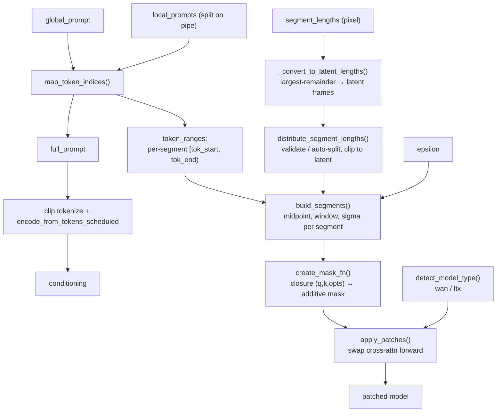
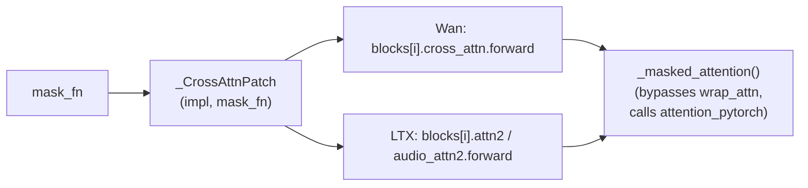

# Prompt Relay

The temporal cross-attention masking that lets different prompt segments dominate
different parts of the video. Originally based on
[Kijai's Prompt Relay](https://github.com/kijai/ComfyUI-PromptRelay) /
[Prompt-Relay](https://gordonchen19.github.io/Prompt-Relay/). Implemented across
[`prompt_relay.py`](../prompt_relay.py) (the math) and
[`patches.py`](../patches.py) (the model surgery), driven from
`_encode_relay()` in [`ltx_director.py`](../ltx_director.py).

## The idea

A single text encoding holds the global prompt followed by each local prompt. During
cross-attention, an **additive penalty** pushes each local prompt's tokens to only
influence the video frames inside that segment's time window. Outside the window the
penalty grows (Gaussian falloff), suppressing that segment's tokens.

## Pipeline

## Steps in detail

### 1. Tokenization — `map_token_indices(raw_tokenizer, global_prompt, local_prompts)`

- Builds `full_prompt = global_prompt + "".join(" " + lp for lp in locals)`.
- Tokenizes **incrementally** (re-tokenizing the growing string) to get each local
  prompt's token range, avoiding SentencePiece context-dependency bugs.
- Accounts for an EOS token if the tokenizer adds one (`eos_adj`).
- `get_raw_tokenizer(clip)` digs the raw HF/SentencePiece tokenizer out of the
  ComfyUI CLIP wrapper by scanning attributes for one exposing `.tokenizer`.
- Raises if a local prompt produces zero tokens.

### 2. Segment lengths — pixel → latent

- `_convert_to_latent_lengths(pixel_lengths, temporal_stride, latent_frames)` maps
  pixel-space lengths to integer latent-frame counts using the **largest-remainder**
  method. If the pixel sum looks like full coverage (within one stride of
  `latent_frames * stride`) it pins the total to `latent_frames`; otherwise it keeps
  partial coverage. Guarantees every segment gets ≥1 latent frame.
- `distribute_segment_lengths(num_segments, latent_frames, specified)` validates the
  count matches the number of locals (or auto-splits with ceil division) and clips
  the cumulative sum to `latent_frames`.

### 3. Penalty metadata — `build_segments(token_ranges, segment_lengths, epsilon, relay_options)`

For each segment produces a dict:

- `local_token_idx` = `arange(tok_start, tok_end)` — which key tokens it covers.
- `midpoint` = center frame of the segment (`(2*cursor + L)//2`).
- `window` = `max(L//2 - 2, 0)` — flat zero-penalty zone around the midpoint.
- `sigma` = `1 / ln(1/epsilon)` — Gaussian falloff width (paper default; small
  epsilon → sharp boundaries).
- Parallel `*_audio` knobs for the LTX audio cross-attention path.

### 4. Penalty matrices

- `build_temporal_cost(q_token_idx, Lq, Lk, ...)` — video path. Query rows map to
  integer frames via `arange(Lq) // tokens_per_frame`. Cost is
  `strength * relu(|frame - midpoint| - window)^2 / (2*sigma^2)`, written into the
  columns for that segment's tokens.
- `build_temporal_cost_scaled(...)` — for queries that don't map to integer frames
  (LTX audio tokens), frames are interpolated as `arange(Lq) * latent_frames / Lq`.

### 5. Mask closure — `create_mask_fn(q_token_idx, fallback_tokens_per_frame, latent_frames)`

Returns `mask_fn(q, k, transformer_options)` that the patched attention calls:

- Returns `None` (no masking) when `Lq == Lk` (self-attention), on the
  unconditional/negative pass, or when key length indicates cross-modal text padding.
- Picks `"video"` vs `"scaled"` mode by comparing `Lq` to `latent_frames * tpf`.
- Caches the built matrix per `(Lq, Lk, mode, device)` and returns it **negated**
  (additive log-domain penalty).

### 6. Model patching — `apply_patches(model_clone, arch, mask_fn)` (`patches.py`)

- `detect_model_type(model)` returns `(arch, patch_size, temporal_stride)`:
  `"wan"` (has `patch_size`, no `patchifier`, stride 4) or `"ltx"` (has
  `patchifier`, stride = `vae_scale_factors[0]`).
- For **Wan**: patches each block's `cross_attn.forward` with `_wan_i2v_forward` or
  `_wan_t2v_forward` (depending on `WanI2VCrossAttention`).
- For **LTX**: patches each transformer block's `attn2` and `audio_attn2`
  `forward` with `_ltx_forward`.
- Patches are installed via `model_clone.add_object_patch(key, ...)` using a
  `_CrossAttnPatch` descriptor that binds `(impl, mask_fn)` as a method.
- `_check_unpatched` raises if another node (e.g. KJNodes NAG) already patched that
  forward — **stacking is unsupported**.

### 7. Masked attention — `_masked_attention(...)` (`patches.py`)

Calls `comfy.ldm.modules.attention.attention_pytorch(..., mask=mask, _inside_attn_wrapper=True)`
directly, bypassing `wrap_attn` (SageAttention etc. may ignore masks). When `mask_fn`
returns `None`, the patched forward falls back to `optimized_attention`.

## Where it's invoked

`_encode_relay(model, clip, latent, global_prompt, local_prompts, segment_lengths, epsilon)`
in `ltx_director.py` ties it together: validates inputs aren't `None`, splits and
checks local prompts (raises on an empty segment prompt), detects arch, computes
token geometry, runs steps 1–6, clones the model, applies patches, and returns
`(patched_model, conditioning)`.

> The standalone `LTXSequencer`/`LTXKeyframer` nodes do **not** use prompt relay —
> they only insert guide keyframes. Prompt relay is exclusive to LTX Director.
